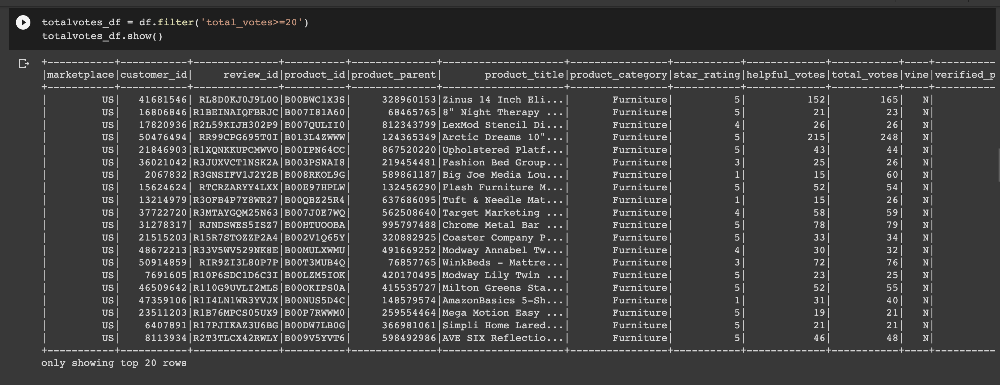
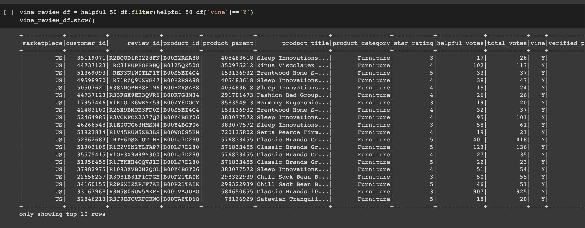
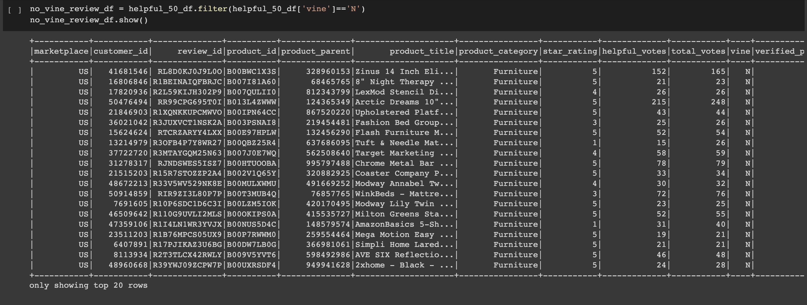
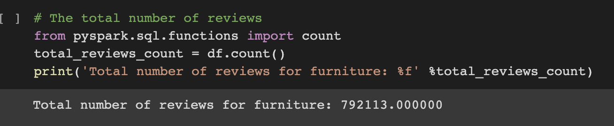
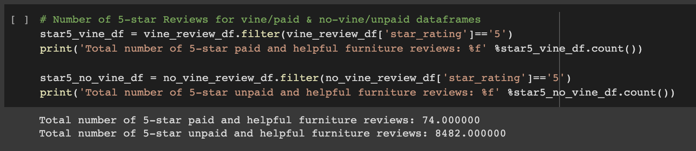
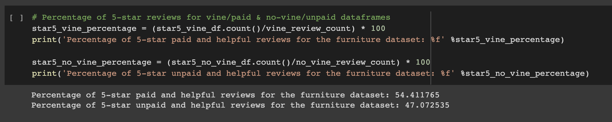

# Amazon_Product_Review_Analysis

## Pipeline of Performing ETL on Amazon Product Reviews

* From the [Amazon Review Datasets](https://s3.amazonaws.com/amazon-reviews-pds/tsv/index.txt), pick a dataset to analyze. **All the datasets have the same data columns as shown below**

* Set up a Postgres database using AWS' relational databse service (RDS)

* In pgAdmin, run a new query to create the tables for the new database

* `Extract` one of the datasets and create a new DataFrame
  - For this project, a **furniture** dataset was selected

* `Transform` the extracted dataset into four DataFrames with the correct columns and `Load` them into their respective tables in pgAdmin:
  - Customers Table DataFrame
  
  - Products Table DataFrame
  
  - Review ID Table DataFrame
  
  - Vine Revie Table DataFrame
  

## Pipeline of Determining Bias of Vine Reviews

* The same dataset (`furniture`) from above was selected for analysis
* Filter the data and create a new DataFrame or table to retrieve all the rows where the `total_votes count is equal to or greater than 20` to pick reviews that are more likely to be helpful and to avoid having division by zero errors later on.

* Filter the new DataFrame or table created above and create a new DataFrame or table to retrieve all the rows where the `number of helpful_votes divided by total_votes is equal to or greater than 50%`

* Filter the DataFrame or table created above, and create a new DataFrame or table that retrieves all the rows where a review was written as part of the Vine program (paid), `vine == 'Y'`.

* Retrieve all the rows where the review was not part of the Vine program (unpaid), `vine == 'N'`.

* Determine the total number of reviews

* Determine the number of 5-star reviews

* Determine the percentage of 5-star reviews for the two types of review (paid vs unpaid)

