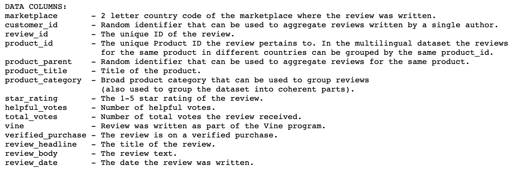

# Amazon_Product_Review_Analysis

## Pipeline

* From the [Amazon Review Datasets](https://s3.amazonaws.com/amazon-reviews-pds/tsv/index.txt), pick a dataset to analyze. **All the datasets have the same data columns as shown below**

* Create a new database with Amazon RDS

* Create a new database in Amazon RDS

* Run a new query to create the tables for the new database