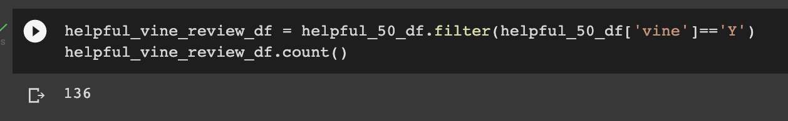
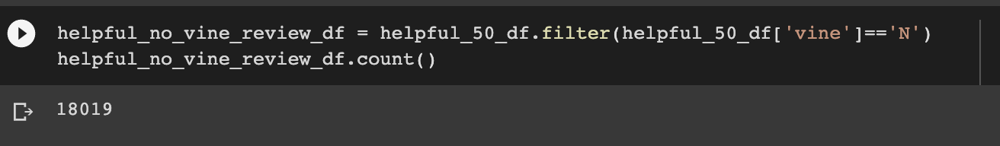
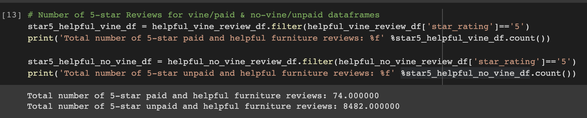
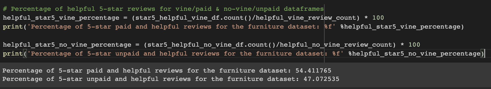
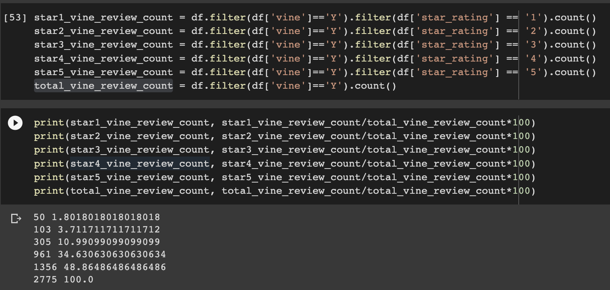
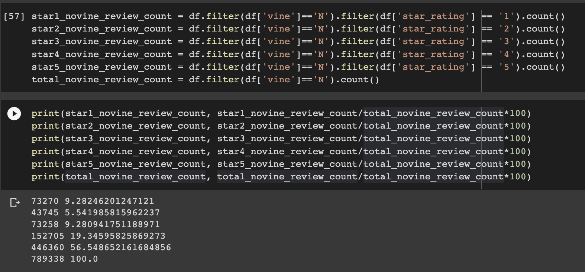

# Amazon_Product_Review_Analysis

## Pipeline of Performing ETL on Amazon Product Reviews

* From the [Amazon Review Datasets](https://s3.amazonaws.com/amazon-reviews-pds/tsv/index.txt), pick a dataset to analyze. **All the datasets have the same data columns as shown below**

* Set up a Postgres database using AWS' relational databse service (RDS)

* In pgAdmin, run a new query to create the tables for the new database

* `Extract` one of the datasets and create a new DataFrame
  - For this project, a **furniture** dataset was selected

* `Transform` the extracted dataset into four DataFrames with the correct columns and `Load` them into their respective tables in pgAdmin:
  - Customers Table DataFrame
  
  - Products Table DataFrame
  
  - Review ID Table DataFrame
  
  - Vine Revie Table DataFrame
  

## Results

* The same dataset (`furniture`) from above was selected for analysis
* Analyses were done according to the 3 following questions:
  > How many Vine reviews and non-Vine reviews were there?

  > How many Vine reviews were 5 stars? How many non-Vine reviews were 5 stars?
  
  > What percentage of Vine reviews were 5 stars? What percentage of non-Vine reviews were 5 stars?

#### Total Number of Vine/Paid Reviews & Non-Vine/Non-Paid Reviews
  - Total Number of Vine/Paid Reviews: `2,775`
  

  - Total Number of Non-Vine/Unpaid Reviews: `789,338`
  

#### Total Number of 5-star Vine/Paid Reviews & 5-star Non-Vine/Non-Paid Reviews
  - Total Number of 5-star Vine/Paid Reviews: `1,356`
  
  - Total Number of 5-star Non-Vine/Unpaid Reviews: `446,360`
  

#### Percentage of 5-star Vine/Paid Reviews & 5-star Non-Vine/Non-Paid Reviews
  > Percentage of 5-star Vine/Paid Reviews: `1,356/2,775 * 100 = 48.9%`

  > Percentage of 5-star Non-Vine/Non-Paid Reviews: `446,360/789,338 * 100 = 56.5%`

* Performing the same analysis with "helpful" reviews (a.k.a total votes greater than 20 and the number of helpful_votes divided by total_votes is equal to or greater than 50%), 
  - Total Number of Helpful Vine/Paid Reviews: `136`
  
  - Total Number of Helpful Non-Vine/Unpaid Reviews: `18,019`
  

  - Total Number of Helpful 5-star Vine/Paid Reviews: `74`
  - Total Number of Helpful 5-star Non-Vine/Unpaid Reviews: `8,482`
  

  - Percentage of Helpful 5-star Vine/Paid Reviews: `74/136 * 100 = 54.4%`
  - Percentage of Helpful 5-star Non-Vine/Paid Reviews: `8,482/18,019 * 100 = 47.1%`
  

## Summary
  1. A total number of Vine/Paid reviews compared to that of Non-Vine/Non-Paid reviews is very small: `2,775 (Vine) vs. 789,398 (Non-Vine)`
  2. Similarly, a total number of 5-star Vine/Paid reviews compared to that of 5-star Non-Vine/Non-Paid reviews is also very small: `1,356 (Vine) vs. 446,360 (Non-Vine)`
  3. Relatively speaking, percentages for these two different types of review look similar as they are both around `50%`. However, it's not reasonable to think that they carry the same weight since the sample size for the non-vine/unpaid reviews is much greater.

## Recommendation
To make the best insight out of the `Vine/Paid Review` analysis, I suggest another analysis within the `Vine` and `Non-Vine` reviews. To be more clear, by having a breakdown of ratings from `1-star` to `5-star` for the `Vine/Paid` and `Non-Vine/Unpaid` reviews, it'd be easier to see if there was any positive bias in the `Vine/Paid` Reviews.

* Vine/Paid Review Rating Breakdown:

* Non-Vine/Unpaid Review Rating Breakdown:

As seen in the two figures, `Non-Vine/Unpaid` reviews have more unfavorable ratings for the furniture product than `Vine/Paid` reviews as there are about a total of **24%** `1-3` ratings for `Non-Vine/Unpaid` reviews whereas there are about a total of **16%** `1-3` ratings for `Vine/Paid` reviews. Which means `4-5` ratings add up to **84%** for `Vine/Paid` reviews while it's **76%** for the same category with `Non-Vine/Unpaid`. 8% may be a small number relatively but it definitely shows there's a difference between the two types of review.  