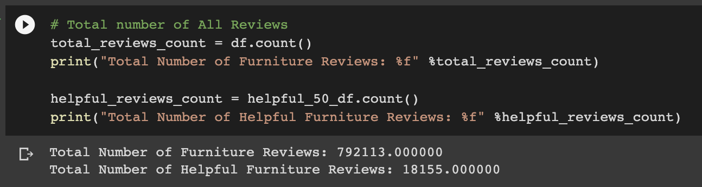
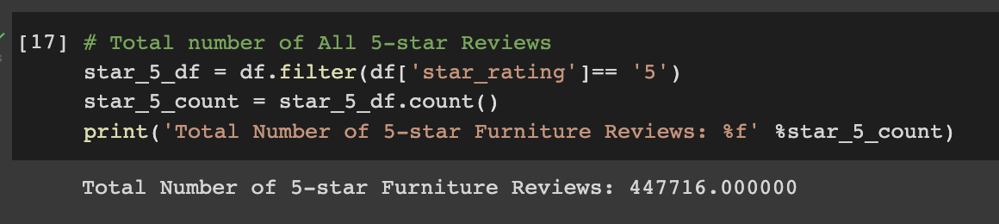
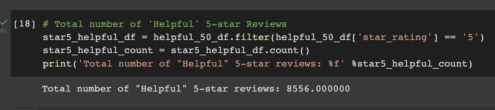
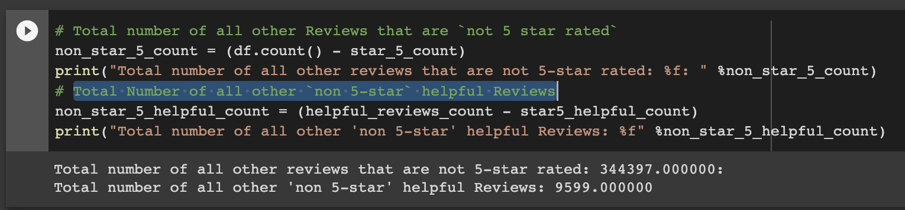

# Amazon_Product_Review_Analysis

## Pipeline of Performing ETL on Amazon Product Reviews

* From the [Amazon Review Datasets](https://s3.amazonaws.com/amazon-reviews-pds/tsv/index.txt), pick a dataset to analyze. **All the datasets have the same data columns as shown below**

* Set up a Postgres database using AWS' relational databse service (RDS)

* In pgAdmin, run a new query to create the tables for the new database

* `Extract` one of the datasets and create a new DataFrame
  - For this project, a **furniture** dataset was selected

* `Transform` the extracted dataset into four DataFrames with the correct columns and `Load` them into their respective tables in pgAdmin:
  - Customers Table DataFrame
  
  - Products Table DataFrame
  
  - Review ID Table DataFrame
  
  - Vine Revie Table DataFrame
  

## Pipeline of Determining Bias of Vine Reviews

* The same dataset (`furniture`) from above was selected for analysis
* Total Number of Furniture Reviews

* Total Number of `5-star` Furniture Reviews

* Total Number of `Helpful 5-star` Furniture Reviews

* Total number of all other Reviews that are `not 5 star rated` & Total Number of all other `non 5-star` helpful Reviews

