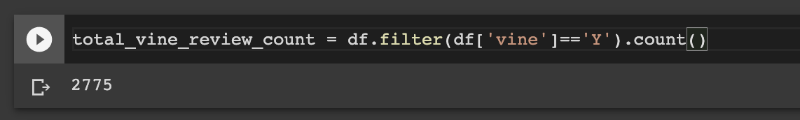

# Amazon_Product_Review_Analysis

## Pipeline of Performing ETL on Amazon Product Reviews

* From the [Amazon Review Datasets](https://s3.amazonaws.com/amazon-reviews-pds/tsv/index.txt), pick a dataset to analyze. **All the datasets have the same data columns as shown below**

* Set up a Postgres database using AWS' relational databse service (RDS)

* In pgAdmin, run a new query to create the tables for the new database

* `Extract` one of the datasets and create a new DataFrame
  - For this project, a **furniture** dataset was selected

* `Transform` the extracted dataset into four DataFrames with the correct columns and `Load` them into their respective tables in pgAdmin:
  - Customers Table DataFrame
  
  - Products Table DataFrame
  
  - Review ID Table DataFrame
  
  - Vine Revie Table DataFrame
  

## Results

* The same dataset (`furniture`) from above was selected for analysis
* Analyses were done according to the 3 following questions:
  > How many Vine reviews and non-Vine reviews were there?

  > How many Vine reviews were 5 stars? How many non-Vine reviews were 5 stars?
  
  > What percentage of Vine reviews were 5 stars? What percentage of non-Vine reviews were 5 stars?

#### Total Number of Vine/Paid Reviews & Non-Vine/Non-Paid Reviews

#### Total Number of 5-star Vine/Paid Reviews & 5-star Non-Vine/Non-Paid Reviews

#### Percentage of 5-star Vine/Paid Reviews & 5-star Non-Vine/Non-Paid Reviews
  > Percentage of 5-star Vine/Paid Reviews: `1,356/2,775 * 100 = 48.9%`

  > Percentage of 5-star Non-Vine/Non-Paid Reviews: `446,360/789,338 * 100 = 56.5%` 